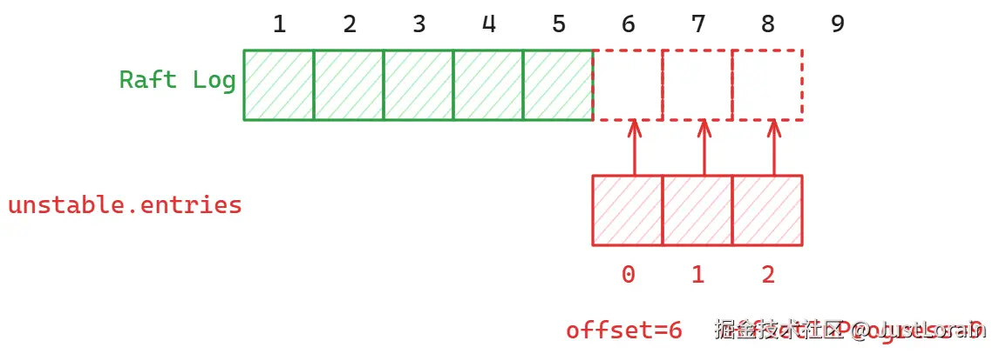
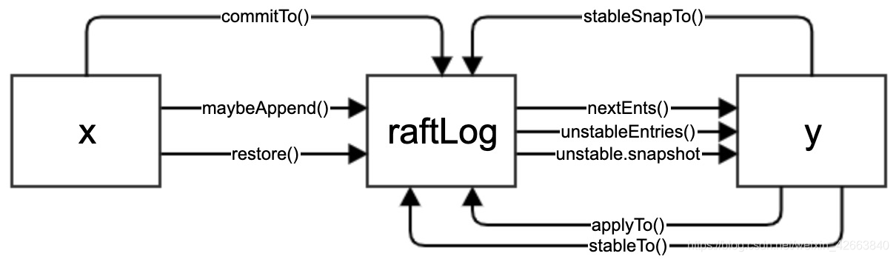

https://blog.csdn.net/cyq6239075/article/details/105326576

节点之间传递的是消息（Message），每条消息中可以携带多条Entry记录，每条记录对应一个独立的操作

Message是所有消息的抽象，包括了各种类型消息所需要的字段

https://blog.csdn.net/weixin_42663840/article/details/100005978

2024-11-27

# 概念简单介绍

1. 使用者：etcd把raft封装成独立的包，只实现算法本身
2. 索引：主要指日志索引，一个无符号64整型数据，raft日志索引是按照日志的产生时间顺序递增的，而raft的leader让索引保持有序自增的机制
3. 提交：可搜索两阶段提交协议了解概念，大概意思是leader收到超过一般以上的节点回复消息后就把该日志提交。提交的日志就会被raft认为可靠，因为他已经被超过一般以上的节点接收了。提交索引就是所有提交日志里最大的索引
4. 应用：在第一条提到，raft是独立包，无业务逻辑，raft本身和对象存储也没有半点关系。etcd把用户的一个PUT操作封装层一条日志并通过raft同步到所有etcd节点，etcd节点或得日志并执行PUT操作才算是完成了用户的起来归侨。“etcd节点或得日志并执行”定义为应用
5. 任期：raft通过选举方式选出leader，那么每一轮选举都有一个唯一标识，就是任期
6. 节点：因为raft是一个分布式一致性算法，所以应用在集群中，一般为3、5、7。。。个节点。raft使用者和raft本身经过编译、连接成一个程序，所以raft所在节点和使用者所在的节点是相同的
7. 快照：可以理解为使用者在某一时刻的全量，如果了解视频编解码技术的读者可以把他理解为关键帧
8. 。使用者的状态等于最近一次快照的基础上逐条应用该快照之后的日志条目，而快照之前的日志就没用了，这样就可以在有限的存储空间下实现日志可靠存储，否则无限的日志条目就会消耗无限的存储空间。有了快照让系统恢复变得更高效，否则从0开始逐条日志应用，效率就太低下了。etcd默认会每10000条日志做一次快照。

# LOG

## log的实现

其实etcd的raft包中的log模块只是实现了Entry的简单管理，用C++语言描述就是`std::vector<Entry>`的各种操作。新来的日志追加到尾部，从头部弹出日志给etcd应用，整个过程看似简单至极。这在单机系统（确切的说是单进程）确实很简单，但是对于分布式有状态系统来说就会变得相对复杂一点。举一个简单的例子：leader将日志发给其他节点，其他节点就要老老实实的追加日志么？万一日志失效了怎么半？此处读者如果不理解日志为什么会失效，可以搜索两阶段提交协议、三阶提交协议了解一下。raft使用了两阶段提交协议，即leader需要确认超过一半以上的节点收到了日志才能再向peer发提交命令。如果在发送提交命令前leader挂了，就要发起新一轮的选举，此时老leader没有确认提交的日志都变成了无效日志。

虽说日志管理变得复杂了，但是核心原理还是`std::vector<Entry>`的各种操作，无非是形式稍微变化了一下。
```C++
class RaftLog {
public:
    explicit RaftLog(StoragePtr storage, uint64_t max_next_ents_size);
    ~RaftLog();
    static uint64_t unlimited() { return std::numeric_limits<uint64_t>::max();
    }
    
public:
    //storage contains all stable entries since the last snapshot
    StoragePtr storage_;
    //unstable contains all unstable entries and sanpshot.they will be saved into storage
    UnstablePtr unstable_;
    //committed is the highest log positon that is known to be in the stable storage on a quorum nodes
    uint64_t committed_;
    // applied is the highest log position that the application has
    // been instructed to apply to its state machine.
    // Invariant: applied <= committed
    uint64_t applied_;
    // max_next_ents_size is the maximum number aggregate byte size of the messages
    // returned from calls to nextEnts.
    uint64_t max_next_ents_size_;
};
typedef std::shared_ptr<RaftLog> RaftLogPtr;
```

除了committed和applied记录了一些状态，其核心就是storage和unstable。而storage和unstable都可以看作是`std::vector<Entry>`,所以使用者把日志管理分层管理了，而每一层的管理都可以简单抽象为队列的基本操作

2024_10_27

## 完成proto部分

其中定义了日志结构体`Entry`，集群节点配置状态结构体`ConfState`，快照元信息`SnapshotMetadata`，快照结构体`Snapshot`，消息结构体`Message`，要持久化的内容`HardState`，变更结构体`ConfState`

### Entry日志

日志中的信息

* 状态机指令
* leader的任期号
* 日志号（索引）

### HardState持久化状态

每个服务需要持久化当前任期和投票的选择，防止服务器在相同任期内投票两次

```C++
uint64_t term;
uint64_t vote;
uint64_t commit;
```


2024_10_31

## Storage类

MemoryStorage实现storage接口的类，用于在内存中存储raft日志条目。MemoryStorage在内存中维护上述状态信息（hardstate）、快照数据（snapshot）及所有Entry记录

实现方法有

初始化状态，设置硬状态，截取日志，获取任期，压缩日志，添加日志，创建快照，应用快照


成员变量包括硬状态，快照和日志数组

### 日志压缩compact

将`entries_[0]`到conpact_index的日志删除，并更新`entries_[0]`的索引和任期

### 日志添加append

计算偏移量：`entries`中第一个条目索引与`entries_`中第一个条目索引差值计算为偏移量，用于定位新条目在现有条目列表中的位置

* 如果`entries_`的大小大于偏移量，说明现有条目中在offset位置之后的条目与新条目冲突，删除冲突条目，并在末尾插入新条目
  * 在第3.5节，leader处理不一致是通过强制跟随着直接复制自己的日志来解决
* 若`entries_`的大小等于偏移量，则无冲突情况，将新条目直接插入到现有条目的末尾
* 若`entries_`大小小于偏移量，则说明日志缺少某些条目，直接输出错误日志并返回

### 创建快照create_snapshot

https://steinslab.io/archives/2686

将`snapshot_`元数据metadata更新为当前index和term

snapshot=snapshot_

如果传入的index小于等于已有快照的索引，返回一个空快照

计算offset为已有快照的第一个日志的索引，将快照成员变量的index设置为传入index，任期为日志对应索引的term，最后将confstate和data都传给新的快照变量

### 应用快照apply_snapshot

`    entries_.resize(1); //!这里应该就是日志缩减了`

并把`entries_`相关参数设置为快照内容

并将传入的snapshot设置为MemoryStorage中`snapshot_`

如果传入的快照的inedx小于已有快照的index，则说明传入的是旧快照了

## unstable类

unstable使用内存数组维护其中所有的Entry记录，对于leader而言，它维护了客户端请求对应的Entry记录；对于follower节点而言，维护的是从leader节点复制来的记录。无论是leader节点还是follower节点，对于刚刚接收到的Entry记录首先都会被存储在unstable中。然后按照Raft协议将unstable中缓存的这些Entry记录交给上层模块进行处理，上层模块会将这些Entry记录发送到集群其他节点或进行保存（写入storage类）。之后，上层模块会调用Advance（）方法通知底层的raft模块将unstable  中对应的Entry记录删除（因为己经保存到了Storage中）。正因为unstable中保存的Entry记录并未进行持久化，可能会因节点故障而意外丢失，所以被称为unstable。


在unstable 中提供了很多与Storage类似的方法，在raftLog中，很多方法都是先尝试调用unstable的相应方法，在其失败后（unstable的方法返回（0, false）即表示失败），再尝试调用Storage的对应方法。


unstable.maybeFirstlndex（）方法会尝试获取unstable 的第一条Entry 记录的索引值，unstable.maybeLastlndex（）方法会尝试获取unstable 的最后一条Entry记录的索引值，如果获取失败则返回（0, false），unstable.maybeTerm（）方法的主要功能是尝试获取指定Entry记录的Term值，根据条件查找指定的Entry记录的位置。

当unstable.entries 中的Entry记录己经被写入Storage之后，会调用unstable.stableTo（）方法清除entries 中对应的Entry记录，stableTo（）方法的具体实现如下：

entries：用于保存未写入Storage中的Entry记录

offset：entries中的第一条Entry记录的索引值

snapshot：快照数据，该快照数据也是未写入storage中的

```C++
//从unstable类中获取可能的第一个
void Unstable::maybe_first_index(uint64_t &index, bool &ok) {
    if (snapshot_) {
        ok = true;
        index = snapshot_->metadata.index + 1;
    } else {
        ok = false;
        index = 0;
    }
}
```

snapshot包含了已经持久化的日志状态到某个索引index的数据，在此快照之前的日志条目都可以丢弃。

如果entries为空，返回的仍然是`snapshot_->metadata.index + 1`。是不是如果entries数组发生变动，日志系统还是可以通过快照索引准确获取日志起始位置，从而避免依赖entries的状态



假设RaftLog中已经持久化了5个日志条目，现在有3个日志条目存储在unstable中，并且这3个日志条目正在被持久化

`offset=6` 代表位于 `unstable.entries` 切片 0,1,2 位置的日志条目对应的是实际 Raft Log 中 6（0+6），7（1+6），8（1+2）的位置，通过 `offsetInProgress=9` 我们就可以知道 `unstable.entries[:9-6]` 也就是 0,1,2 三个日志条目都正在被持久化。

## RaftLog

`applied_<=committed_`，因为状态机只能应用已经提交的日志条目



1. x收到leader的追加日志请求后调用raftLog.maybeAppend()接口，如果是快照请求调用restore
2. x也会收到leader发来的提交请求（比如可以通过心跳包携带已提交的索引），调用raftLog.commitTo()接口更新提交索引
3. y通过nextEnts()获取(applied,committed]的日志给使用者应用，通过unstableEntries()获取(committed,last]的日志给使用者持久化，通过获取unstabe.snapshot快照给使用者持久化。然后y再调用appliedTo()、stableTo()、stableSnapTo更新raftLog的状态

## 总结

每一条日志Entry需要经过unstable，stable，committed，applied，compacted五个阶段

1. 刚刚收到一条日志会被存储在unstable中，日志在没有被持久化之前如果遇到了换届选举，这个日志可能会被同样index的新日志覆盖，这个一点可以在raftLog.maybeAppend()和unstable.truncateAndAppend()找到相关的处理逻辑。
2. unstable中存储的日志会被使用者写入持久存储（文件）中，这些持久化的日志就会从unstable转移到MemoryStorage中。MemoryStorage并不是持久化存储啊，起始日志是被双写了，文件和MemoryStorage各存储了一份，而raft包只能访问MemoryStorage内容。这样设计的目的是用内存缓冲文件中的日志，在频繁操作日志的是否性能会更高。此处需要注意，MemoryStorage中的日志仅仅代表日志是可靠的，和提交、应用没有任何关系
3. leader会搜集所有peer的接收日志状态，只要日志被超过半数以上的peer接收，那么就会提交该日志，peer接收到leader的数据包更新自己的已提交的最大索引值，这样小于等于该索引值的日志就是可以被提交的日志。
4. 已经提交的日志会被使用者获得，并逐条应用，进而影响使用者的数据状态
5. 已经被应用的日志意味着使用者已经把状态持久化在自己的存储中了，这条日志就可以删除了，避免日志一直追加造成存储无限增大的问题。不要忘了所有的日志都存储在MemoryStorage中，不删除已应用的日志对于内存是一种浪费，这也就是日志的compacted。


# progress&quorum

1. peer:raft中参与选举和投票的节点
2. leader：集群的领导者
3. follower：peer中除了follower以外的节点
4. learner：不参与选举和投票的节点，一致从leader同步日志，只输入不输出，像个学生。空白节点加入集群都是learner
5. quorum：法定人数，在raft中超过一半以上的人数就是法定人数

## progress

```C++
// Progress represents a follower’s progress in the view of the leader. Leader maintains
// progresses of all followers, and sends entries to the follower based on its progress.
```

**progress代表了leader视角的follower进度，leader拥有所有follower的进度，并根据其进度向follower发送日志**

对于raft而言，系统的决策是leader，其他follower都是从leader同步的，即leader发送给follower的。作为leader，需要知道所有peer都同步到什么进度了，所以就有了progress

progress的成员变量

```C++

    /*
    leader与follower之间的状态同步是异步的，leader将日志发送给follower，follwoer再回复收到了哪些日志
    出于效率考虑，leader不会每条日志以类似同步调用的方式发送给follower，而是只要leader有新日志就发送，	 
    next就是记录下一次发送日志起始索引。换言之，发送给peer的最大日志索引是Next-1
    match是经过follower确认接收的最大日志索引
    next-match-1就是inflights的日志数量
    */
	//表示该节点上已成功复制的最新日志条目的索引
    uint64_t match;
    //表示写一条将发送到该节点的日志条目的索引
    uint64_t next;
    // state defines how the leader should interact with the follower.
    //
    // When in ProgressStateProbe, leader sends at most one replication message
    // per heartbeat interval. It also probes actual progress of the follower.
    //
    // When in ProgressStateReplicate, leader optimistically increases next
    // to the latest entry sent after sending replication message. This is
    // an optimized state for fast replicating log entries to the follower.
    //
    // When in ProgressStateSnapshot, leader should have sent out snapshot
    // before and stops sending any replication message.
    //表示当前节点的状态
	// Progress一共有三种状态，分别为探测（StateProbe）、复制（StateReplicate）、快照（StateSnapshot）
    // 探测：一般是系统选举完成后，Leader不知道所有Follower都是什么进度，所以需要发消息探测一下，从
    //    Follower的回复消息获取进度。在还没有收到回消息前都还是探测状态。因为不确定Follower是
    //    否活跃，所以发送太多的探测消息意义不大，只发送一个探测消息即可。
    // 复制：当Peer回复探测消息后，消息中有该节点接收的最大日志索引，如果回复的最大索引大于Match，
    //    以此索引更新Match，Progress就进入了复制状态，开启高速复制模式。复制制状态不同于
    //    探测状态，Leader会发送更多的日志消息来提升IO效率，就是上面提到的异步发送。这里就要引入
    //    Inflight概念了，飞行中的日志，意思就是已经发送给Follower还没有被确认接收的日志数据，
    //    后面会有inflight介绍。
    // 快照：快照状态说明Follower正在复制Leader的快照
    ProgressState state;

    // paused is used in ProgressStateProbe.
    // When Paused is true, raft should pause sending replication message to this peer.
    //在探测状态下使用，表示是否暂停发送复制消息
    bool paused;
    // pending_snapshot is used in ProgressStateSnapshot.
    // If there is a pending snapshot, the pendingSnapshot will be set to the
    // index of the snapshot. If pendingSnapshot is set, the replication process of
    // this Progress will be paused. raft will not resend snapshot until the pending one
    // is reported to be failed.
    //如果有待处理的快照，这个变量将被设置为快照的索引。 在快照被确认失败之前，不会重新发送快照
    uint64_t pending_snapshot;

    // recent_active is true if the progress is recently active. Receiving any messages
    // from the corresponding follower indicates the progress is active.
    // recent_active can be reset to false after an election timeout.
    bool recent_active;

    // inflights is a sliding window for the inflight messages.
    // Each inflight message contains one or more log entries.
    // The max number of entries per message is defined in raft config as MaxSizePerMsg.
    // Thus inflight effectively limits both the number of inflight messages
    // and the bandwidth each Progress can use.
    // When inflights is full, no more message should be sent.
    // When a leader sends out a message, the index of the last
    // entry should be added to inflights. The index MUST be added
    // into inflights in order.
    // When a leader receives a reply, the previous inflights should
    // be freed by calling inflights.freeTo with the index of the last
    // received entry.
    //滑动窗口，控制在飞日志条目的数量和带宽
    /*
    用于控制在飞的日志条目的数量和带宽。
    他的主要作用是记录领导者发送给跟随着但尚未确认的日志条目索引，
    并限制在飞日志条目的数量，以避免网络用晒或跟随着处理不过来的情况
    */
    std::shared_ptr<InFlights> inflights;

    // is_learner is true if this progress is tracked for a learner.
    bool is_learner;
```

探测状态通过paused控制探测消息的发送频率，复制状态通过inflights控制发送流量

raft没有专门的探测消息，而是借助于其他消息实现，比如心跳消息，日志消息等

## inflights

 在解释Inflights前先温习小学的数据题：有一个水池子，一个入水口，一个出水口，小学题一般会问什么时候
 能把池子放满。Inflights就好像这个池子，当Progress在复制状态时，Leader向Peer发日志消息相当于
 放水，Peer回复日志已经收到了相当于出水，当池子满了就不能放水了，也就是上面提到的暂停。作为一个
 容量相对固定的池子，有入水口有出水口，而且需要按照进水的顺序出水，这正符合queue的特性。而raft的
 实现没有使用queue，而是在一个内存块上采用循环方式模拟queue的特性，这样效率会更高。


2024_12_3

# node

raft的接口类


2024_12_11

# readonly类

只读客户端命令只查询复制状态机，而不改变其内容。能否绕开raft日志？没必要每次对read操作都进行一次appendEntried，进而优化操作性能

raft日志的目的是以相同的顺序更改复制到服务器的状态机。而绕过日志提供了一个有吸引力的性能优势：只读查询在许多应用程序中很常见，并且需要将条目追加到日志中的同步磁盘写是很耗时的

为了避免读到旧数据，增加了readindex进行限制，这样leader和follower都可以处理client发来的读请求。当读请求发送到follower时，不需要再重定向到leader，让leader返回读取的结果，follower自身就可以响应读请求：

1. follower向leader索要readindex的值
2. leader收到请求后，向其他成员append空日志，以此确定自己的leader地位并获得自己的commitindex，返回commitindex。（readindex=leader.commitindex)
3. follower在自己的状态机上将日志至少推进到readindex，然后查询自己的状态机，返回结果到client

https://boilingfrog.github.io/2021/08/30/etcd%E4%B8%ADraft%E5%AE%9E%E7%8E%B0%E7%BA%BF%E6%80%A7%E4%B8%80%E8%87%B4%E6%80%A7/

https://blog.csdn.net/Cassie_zkq/article/details/115724570

每次读操作的时候记录此时集群的`committed index`，当状态机的`apply index`大于或等于`committed index`时才读取数据并返回。由于此时状态机已经把读请求发起时的已提交日志进行了apply操作，所以此时状态机的状态就可以反映读请求时的状态，符合线性一致性读的操作

问题：

干嘛用的？

```
    //用于存储只读请求的上下文，用于按顺序跟踪只读请求的处理顺序
    std::vector<std::string> read_index_queue;
```

todo：

网上解释

服务端收到MsgReadIndex消息时，会为其创建一个唯一的消息ID，并作为MsgReadIndex消息的第一条Entry记录。在pendingReadIndex维护了消息ID与对应请求readIndexStatus实例的映射

2024_12_17

# ready类

https://masutangu.com/2018/07/04/etcd-raft-note-2/

https://blog.betacat.io/post/raft-implementation-in-etcd/

# raft

真多啊

​                    // *We send pre-vote requests with a term in our future. If the*

​                    // *pre-vote is granted, we will increment our term when we get a*

​                    // *quorum. If it is not, the term comes from the node that*

​                    // *rejected our vote so we should become a follower at the new*

​                    // *term.*

* 预投票的目的是：测试集群中有没有足够多的节点支持它成为领导者，从而避免无意义的选举失败

* 预投票使用的是当前任期的下一任期

* 如果预投票或得了法定多数，说明具备成为leader 的潜力，此时节点会发起正式选举

* 如果被拒绝，意味着有更高任期的leader或candidate存在。在这种情况下，拒绝预投票的节点会附带它们的当前任期，当前节点可以立即发现自己的任期落后，**转变为追随者（Follower）并更新自己的任期到最新值**。

  

​            //*收到低延迟的可能原因，网络延迟，节点隔离等情况*

​            // *We have received messages from a leader at a lower term. It is possible*

​            // *that these messages were simply delayed in the network, but this could*

​            // *also mean that this node has advanced its term number during a network*

​            // *partition, and it is now unable to either win an election or to rejoin*

​            // *the majority on the old term. If checkQuorum is false, this will be*

​            // *handled by incrementing term numbers in response to MsgVote with a*

​            // *higher term, but if checkQuorum is true we may not advance the term on*

​            // *MsgVote and must generate other messages to advance the term. The net*

​            // *result of these two features is to minimize the disruption caused by*

​            // *nodes that have been removed from the cluster's configuration: a*

​            // *removed node will send MsgVotes (or MsgPreVotes) which will be ignored,*

​            // *but it will not receive MsgApp or MsgHeartbeat, so it will not create*

​            // *disruptive term increases, by notifying leader of this node's activeness.*

​            // *The above comments also true for Pre-Vote*

​            //

​            // *When follower gets isolated, it soon starts an election ending*

​            // *up with a higher term than leader, although it won't receive enough*

​            // *votes to win the election. When it regains connectivity, this response*

​            // *with "pb.MsgAppResp" of higher term would force leader to step down.*

​            // *However, this disruption is inevitable to free this stuck node with*

​            // *fresh election. This can be prevented with Pre-Vote phase.*

当节点收到来自任期较低leader的（MsgApp或MsgHeartbeat）消息时，通常是由于网络延迟导致旧消息到达。另一种可能是由于网络分区，该leader 的任期没更新