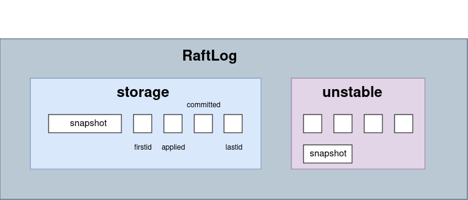

# 1. 文件结构

```
.
├── CMakeLists.txt
├── Procfile.in - 这个文件通常用于定义如何使用goreman或其他类似工具来启动和管理应用程序的进程。
├── raft-kv
│   ├── CMakeLists.txt
│   ├── common：包含一些通用的工具类和函数，可能用于整个项目。
│   │   ├── bytebuffer.cpp/h - 字节缓冲区操作的实现和接口。
│   │   ├── log.h - 日志记录相关的宏定义和接口。
│   │   ├── random_device.cpp/h - 随机数生成器的实现，基于std::random_device。
│   │   ├── slice.h - 数据片段操作的类定义。
│   │   ├── status.cpp/h - 状态类，用于错误处理和状态表示。
│   ├── raft：Raft算法的核心实现
│   │   ├── config.cpp/h - Raft 配置参数的设置和管理。
│   │   ├── node.cpp/h - Raft 节点的实现和接口。
│   │   ├── progress.cpp/h - 跟踪和管理 Raft 节点进度的状态。
│   │   ├── proto.cpp/h - 序列化和反序列化协议缓冲区数据的实现。
│   │   ├── raft.cpp/h - Raft算法的主要实现。
│   │   ├── raft_log.cpp/h - 管理 Raft 日志的类。
│   │   ├── raft_status.cpp/h - Raft 状态的获取和管理。
│   │   ├── readonly.cpp/h - 只读请求的处理。
│   │   ├── ready.cpp/h - 准备就绪的消息，包含需要发送或应用的数据。
│   │   ├── storage.cpp/h - 持久化存储接口，用于 Raft 日志和状态的存储
│   │   ├── unstable.cpp/h - 处理不稳定状态的日志条目
│   │   ├── util.cpp/h - 一些实用工具函数
│   ├── raft-kv.cpp - 项目的主要入口文件，包含 main 函数和程序的初始化代码。
│   ├── server：服务器端的实现
│   │   ├── raft_node.cpp/h - Raft 节点服务器的实现。
│   │   ├── redis_session.cpp/h - Redis 会话管理。
│   │   ├── redis_store.cpp/h - Redis 存储接口，与 Raft 节点交互。
│   ├── snap：快照机制的实现
│   │   ├── SnapshotFeature.cpp/h - 管理 Raft 快照的创建和恢复。
│   ├── transport：网络传输相关的实现：
│   │   ├── peer.cpp/h - 管理对等节点（Peer）的网络连接和通信。
│   │   ├── proto.h - 序列化和反序列化协议缓冲区数据的实现。
│   │   ├── raft_server.cpp/h - Raft 服务器的实现，处理网络消息和状态转换。
│   │   ├── transport.cpp/h - 网络传输层的实现，负责消息的发送和接收。
│   └── wal：Write-Ahead Logging 的实现
│       ├── wal.cpp/h - 管理 WAL 日志，用于在故障恢复时保证数据一致性。WAL 通过记录所有更改到持久化存储之前的数据变更操作，来保证即使在系统崩溃的情况下，数据也不会丢失。
└── tests
    ├── CMakeLists.txt
    ├── network.hpp - 定义了用于网络测试的辅助结构、函数或类。
    ├── raft_snap_test.cpp - 对Raft快照机制的单元测试。
    ├── string_match.cpp - 对字符串匹配功能的测试。
    ├── test_bytebuffer.cpp - 对ByteBuffer类的测试，测试其字节缓冲区操作功能。
    ├── test_msgpack.cpp - 对使用MessagePack序列化和反序列化功能的测试。
    ├── test_progress.cpp - 对Progress类的测试，测试其在Raft算法中跟踪进度的功能。
    ├── test_proto.cpp - 对序列化协议（如Protocol Buffers）的测试。
    ├── test_raft.cpp - 对Raft核心算法实现的测试。
    ├── test_raftlog.cpp - 对Raft日志操作的测试，如日志条目的追加和恢复。
    ├── test_rawnode.cpp - 对RawNode类（一个线程不安全的Raft节点实现）的测试。
    ├── test_SnapshotFeature.cpp - 对快照创建和恢复功能的测试。
    ├── test_storage.cpp - 对Raft状态机存储层的测试，测试其持久化和恢复状态的能力。
    ├── test_unstable.cpp - 对处理不稳定状态（如未提交的日志条目）的测试。
    └── test_wal.cpp - 对WAL（Write-Ahead Logging）日志系统的测试。

8 directories, 71 files
```

# 2. 代码解读

## 2.1 概念简单介绍

1. raft被封装成独立的包，只实现算法本身
2. index：主要指日志索引，无符号64整型数据，raft日志索引是按照日志的产生时间顺序递增的，而raft的leader让索引保持有序自增的机制
3. commit：leader收到超过一半以上的节点回复消息后就把该日志提交。提交的日志被raft认为可靠，因为被一半以上的节点接收了。提交索引就是所有提交的日志里最大的索引
4. apply：raft把用户的一个PUT操作封装层一条日志并通过raft同步到所有节点，节点获得日志并执行PUT操作才算是完成了用户的指令。“节点或得日志并执行”定义为应用
5. term：raft通过选举方式选出leader，那么每一轮选举的唯一标识就是term
6. 节点：因为raft是一个分布式一致性算法，所以应用在集群中，一般为3、5、7。。。个节点。raft使用者和raft本身经过编译、连接成一个程序，所以raft所在节点和使用者所在的节点是相同的
7. 快照：可以理解为使用者在某一时刻的全量，如果了解视频编解码技术的读者可以把他理解为关键帧

## 2.2 log的实现及管理



raft不实现具体业务，只是让多个节点有序应用相同的日志进而达到状态的一致性，至于日志中的内容是什么，raft不关心。

raft使用了两阶段提交协议，即leader需要确认超过一半以上的节点收到了日志才能向peer发提交命令。如果在发送提交命令前leader挂了，就要发起新一轮的选举，此时老leader没有确认提交的日志都变成了无效日志。

单独的一条日志结构如下：

```c++
typedef uint8_t EntryType;
const EntryType EntryNormal = 0;
//集群条目变更，如增加删除
const EntryType EntryConfChange = 1;
//日志
struct Entry {
    Entry() : type(EntryNormal), term(0), index(0) {}

    explicit Entry(Entry &&entry)
        : type(entry.type), term(entry.term), index(entry.index), data(std::move(entry.data)) {}

    kv::proto::Entry &operator=(const kv::proto::Entry &entry) = default;

    Entry(const Entry &entry) = default;
    //有参构造
    explicit Entry(EntryType type, uint64_t term, uint64_t index, std::vector<uint8_t> data)
        : type(type), term(term), index(index), data(std::move(data)) {}

    uint32_t serialize_size() const;
    uint32_t payload_size() const { return static_cast<uint32_t>(data.size()); }

    bool operator==(const Entry &entry) const {
        return type == entry.type && term == entry.term && index == entry.index
               && data == entry.data;
    }

    bool operator!=(const Entry &entry) const { return !(*this == entry); }

    EntryType type;
    uint64_t term;
    uint64_t index;
    std::vector<uint8_t> data;
    /*
    MSGPACK_DEFINE会自动生成这些成员变量的序列化和反序列化方法
    MessagePack 的序列化过程会将 type、term、index、data 依次编码到一个
     MessagePack 数据结构中，反序列化时会按顺序解码到相应的成员变量。
     */
    MSGPACK_DEFINE(type, term, index, data);
};
typedef std::shared_ptr<Entry> EntryPtr;
```

entry可以解读为第term届，leader产生的第index条日志，类型是type，内容是data


proto文件里，和消息相关的定义：

```C++
typedef uint8_t MessageType;

const MessageType MsgHup = 0;
const MessageType MsgBeat = 1;
const MessageType MsgProp = 2;
const MessageType MsgApp = 3;
const MessageType MsgAppResp = 4;
const MessageType MsgVote = 5;
const MessageType MsgVoteResp = 6;
const MessageType MsgSnap = 7;
const MessageType MsgHeartbeat = 8;
const MessageType MsgHeartbeatResp = 9;
const MessageType MsgUnreachable = 10;
const MessageType MsgSnapStatus = 11;
const MessageType MsgCheckQuorum = 12;
const MessageType MsgTransferLeader = 13;
const MessageType MsgTimeoutNow = 14;
const MessageType MsgReadIndex = 15;
const MessageType MsgReadIndexResp = 16;
const MessageType MsgPreVote = 17;
const MessageType MsgPreVoteResp = 18;

const MessageType MsgTypeSize = 19;

    struct Message {
        Message()
            : type(MsgHup), to(0), from(0), term(0), log_term(0), index(0), commit(0),
              reject(false), reject_hint(0) {}

        bool operator==(const Message &msg) const {
            return type == msg.type && to == msg.to && from == msg.from && term == msg.term
                   && log_term == msg.log_term && index == msg.index && entries == msg.entries
                   && commit == msg.commit && snapshot.equal(msg.snapshot) && reject == msg.reject
                   && reject_hint == msg.reject_hint && context == msg.context;
        }

        bool is_local_msg() const;

        bool is_response_msg() const;

        MessageType type;
        uint64_t to;
        uint64_t from;
        uint64_t term;
        uint64_t log_term;
        uint64_t index;
        std::vector<Entry> entries;
        uint64_t commit;
        Snapshot snapshot;
        bool reject;//用于响应类型的消息，表示是否拒绝收到的消息
        uint64_t reject_hint;//在follower节点拒绝leader节点的消息之后，会在该字段记录一个Entry索引值供leader节点
        std::vector<uint8_t> context;
        MSGPACK_DEFINE(type, to, from, term, log_term, index, entries, commit, snapshot, reject,
                       reject_hint, context);
    };
    typedef std::shared_ptr<Message> MessagePtr;
```

raft会把若干个Entry封装在Message中

Message是所有消息的抽象，包括的各种消息所需要的字段


日志管理的核心：`std::vector<Entry>`的各种操作

`RaftLog`类的定义：

```C++
class RaftLog{
    ...
    ...
public:
    // storage contains all stable entries since the last snapshot.
    StoragePtr storage_;

    // unstable contains all unstable entries and snapshot.
    // they will be saved into storage.
    UnstablePtr unstable_;

    // committed is the highest log position that is known to be in
    // stable storage on a quorum of nodes.
    uint64_t committed_;
    // applied is the highest log position that the application has
    // been instructed to apply to its state machine.
    // Invariant: applied <= committed
    uint64_t applied_;

    // max_next_ents_size is the maximum number aggregate byte size of the messages
    // returned from calls to nextEnts.
    //限制日志获取大小的总量
    uint64_t max_next_ents_size_;
};
typedef std::shared_ptr<RaftLog> RaftLogPtr;
```

* storage存储了从最后一次snapshot到现在所有可靠的日志，这个类存储日志，但没有持久化的功能，日志的持久化相关处理raft并不关心。这个存储可以理解为日志的缓存，raft访问最近的日志都是通过他的，storage中的日志在使用者的持久化存储也有一份，当raft访问这些日志时，无需访问持久化的存储，不仅效率高，而且与持久化存储充分解耦
* unstable：哪些还没有被使用者持久化的日志存储在unstable中。在使用者没有通知raft日志持久化完毕前，这些日志都还不可靠，需要unstable类来管理，持久化完毕后从unstable类删除，并记录在storage中

### 2.2.1 unstable

```C++
// Unstable.entries[i] has raft log position i+unstable.offset.
// Note that unstable.offset may be less than the highest log
// position in storage; this means that the next write to storage
// might need to truncate the log before persisting unstable.entries.
class Unstable {
public:
    explicit Unstable(uint64_t offset) : offset_(offset) {}

    // maybe_first_index returns the index of the first possible entry in entries
    // if it has a snapshot.
    void maybe_first_index(uint64_t &index, bool &ok);

    // maybe_last_index returns the last index if it has at least one
    // unstable entry or snapshot.
    void maybe_last_index(uint64_t &index, bool &ok);

    // maybe_term returns the term of the entry at index i, if there
    // is any.
    void maybe_term(uint64_t index, uint64_t &term, bool &ok);

    void stable_to(uint64_t index, uint64_t term);

    void stable_snap_to(uint64_t index);

    void restore(proto::SnapshotPtr snapshot);

    void truncate_and_append(std::vector<proto::EntryPtr> entries);

    void slice(uint64_t low, uint64_t high, std::vector<proto::EntryPtr> &entries);

public:
    // the incoming unstable snapshot, if any.
    proto::SnapshotPtr snapshot_;
    // all entries that have not yet been written to storage.
    std::vector<proto::EntryPtr> entries_;
    uint64_t offset_;
};
typedef std::shared_ptr<Unstable> UnstablePtr;
```

对于follower而言，维护了客户端请求对应的Entry记录；对于follower节点而言，维护的是从leader节点复制来的记录，无论是leader还是follower，对于刚刚接收到的Entry记录首先都会被存储在unstable中

提供的接口都是对`std::vector<Entry>`的操作

### 2.2.2 storage

```C++
// MemoryStorage implements the Storage interface backed by an
// in-memory array.
//实现storage接口的类，用于在内存中存储raft日志条目
class MemoryStorage : public Storage {
public:
    // creates an empty MemoryStorage
    explicit MemoryStorage() : snapshot_(new proto::Snapshot()) {
        // When starting from scratch populate the list with a dummy entry at term zero.
        //从头开始时，用一个任期为零的空条目填充列表
        proto::EntryPtr entry(new proto::Entry());
        entries_.emplace_back(std::move(entry));
    }

    virtual Status initial_state(proto::HardState &hard_state, proto::ConfState &conf_state);

    void set_hard_state(proto::HardState &hard_state);

    virtual Status entries(uint64_t low, uint64_t high, uint64_t max_size,
                           std::vector<proto::EntryPtr> &entries);

    virtual Status term(uint64_t i, uint64_t &term);

    virtual Status last_index(uint64_t &index);

    virtual Status first_index(uint64_t &index);

    virtual Status snapshot(proto::SnapshotPtr &snapshot);

    // compact discards all log entries prior to compact_index.
    // It is the application's responsibility to not attempt to compact an index
    // greater than raftLog.applied.
    Status compact(uint64_t compact_index);

    // append the new entries to storage.
    Status append(std::vector<proto::EntryPtr> entries);

    // create_snapshot makes a snapshot which can be retrieved with Snapshot() and
    // can be used to reconstruct the state at that point.
    // If any configuration changes have been made since the last compaction,
    // the result of the last apply_conf_change must be passed in.
    Status create_snapshot(uint64_t index, proto::ConfStatePtr cs, std::vector<uint8_t> data,
                           proto::SnapshotPtr &snapshot);

    // ApplySnapshot overwrites the contents of this Storage object with
    // those of the given snapshot.
    Status apply_snapshot(const proto::Snapshot &snapshot);

public:
    Status last_index_impl(uint64_t &index);
    Status first_index_impl(uint64_t &index);

    std::mutex mutex_;
    proto::HardState hard_state_;
    proto::SnapshotPtr snapshot_;
    // entries_[i] has raft log position i+snapshot.Metadata.Index
    std::vector<proto::EntryPtr> entries_;
};
```

storage提供的很多接口，和unstable都很类似

### 2.2.3 RaftLog

上文给出了成员变量，这里只列举出了RaftLog类提供的接口

```C++
class RaftLog {
public:
    explicit RaftLog(StoragePtr storage, uint64_t max_next_ents_size);

    ~RaftLog();

    static uint64_t unlimited() { return std::numeric_limits<uint64_t>::max(); }

    std::string status_string() const {
        char buffer[64];
        int n = snprintf(buffer, sizeof(buffer),
                         "committed=%lu, applied=%lu, unstable.offset=%lu, unstable.entries=%lu",
                         committed_, applied_, unstable_->offset_, unstable_->entries_.size());
        return std::string(buffer, n);
    }

    // maybe_append returns (0, false) if the entries cannot be appended. Otherwise,
    // it returns (last index of new entries, true).
    void maybe_append(uint64_t index, uint64_t log_term, uint64_t committed,
                      std::vector<proto::EntryPtr> entries, uint64_t &last_new_index, bool &ok);

    // return last index
    uint64_t append(std::vector<proto::EntryPtr> entries);

    // find_conflict finds the index of the conflict.
    // It returns the first pair of conflicting entries between the existing
    // entries and the given entries, if there are any.
    // If there is no conflicting entries, and the existing entries contains
    // all the given entries, zero will be returned.
    // If there is no conflicting entries, but the given entries contains new
    // entries, the index of the first new entry will be returned.
    // An entry is considered to be conflicting if it has the same index but
    // a different term.
    // The first entry MUST have an index equal to the argument 'from'.
    // The index of the given entries MUST be continuously increasing.
    uint64_t find_conflict(const std::vector<proto::EntryPtr> &entries);

    // next_entries returns all the available entries for execution.
    // If applied is smaller than the index of snapshot, it returns all committed
    // entries after the index of snapshot.
    void next_entries(std::vector<proto::EntryPtr> &entries) const;

    // has_next_entries returns if there is any available entries for execution. This
    // is a fast check without heavy slice in next_entries.
    bool has_next_entries() const;

    // slice returns a slice of log entries from low through high-1, inclusive.
    Status slice(uint64_t low, uint64_t high, uint64_t max_size,
                 std::vector<proto::EntryPtr> &entries) const;

    // is_up_to_date determines if the given (lastIndex,term) log is more up-to-date
    // by comparing the index and term of the last entries in the existing logs.
    // If the logs have last entries with different terms, then the log with the
    // later term is more up-to-date. If the logs end with the same term, then
    // whichever log has the larger lastIndex is more up-to-date. If the logs are
    // the same, the given log is up-to-date.
    bool is_up_to_date(uint64_t lasti, uint64_t term) const {
        uint64_t lt = last_term();
        return term > lt || (term == lt && lasti >= last_index());
    }

    std::vector<proto::EntryPtr> &unstable_entries() { return unstable_->entries_; }

    bool maybe_commit(uint64_t max_index, uint64_t term);

    void restore(proto::SnapshotPtr snapshot);

    Status snapshot(proto::SnapshotPtr &snap) const;

    void applied_to(uint64_t index);

    void stable_to(uint64_t index, uint64_t term) { unstable_->stable_to(index, term); }

    void stable_snap_to(uint64_t index) { unstable_->stable_snap_to(index); }

    Status entries(uint64_t index, uint64_t max_size, std::vector<proto::EntryPtr> &entries) const {
        if (index > last_index()) {
            return Status::ok();
        }
        return slice(index, last_index() + 1, max_size, entries);
    }

    void commit_to(uint64_t to_commit);

    bool match_term(uint64_t index, uint64_t t);

    uint64_t last_term() const;

    Status term(uint64_t index, uint64_t &t) const;

    uint64_t first_index() const;

    uint64_t last_index() const;

    Status must_check_out_of_bounds(uint64_t low, uint64_t high) const;

    void all_entries(std::vector<proto::EntryPtr> &entries);
    
    	...
        ...
        ...
        ...
};
```

### 2.2.4 总结

每一条日志都会经过unstable、stable、committed、applied、compacted五个阶段

1. 刚收到的日志会被存储在unstable中，日志如果在没被持久化之前遇到了换届选举，这个日志可能会被相同索引值的新日志覆盖，这一点可以在`RaftLog::maybe_append()`中和`unstable::truncate_and_append()`中找到

```C++
//leader有一个参数记录下一次要发送给某个节点的索引起始值也就是entries[0].Index，而index和logTerm值就是
// entries[-1].Index和entries[-1].Term。
void RaftLog::maybe_append(uint64_t index, uint64_t log_term, uint64_t committed,
                           std::vector<proto::EntryPtr> entries, uint64_t &last_new_index,
                           bool &ok) {
    //检查日志条目是否匹配
    if (match_term(index, log_term)) {
        uint64_t lastnewi = index + entries.size(); //新日志的最后一个索引
        uint64_t ci = find_conflict(entries);       //找到冲突的索引
        if (ci == 0) {
            //no conflict
        } else if (ci <= committed_) {
            LOG_FATAL("entry %lu conflict with committed entry [committed(%lu)]", ci, committed_);
        } else {
            //处理冲突的情况
            assert(ci > 0);
            uint64_t offset = index + 1;                         //新日志的起始索引
            uint64_t n = ci - offset;                            //需要删除的条目数量
            entries.erase(entries.begin(), entries.begin() + n); //删除冲突条目之前的索引
            append(std::move(entries));                          //附加剩余的新条目
        }

        commit_to(std::min(committed, lastnewi));

        last_new_index = lastnewi; //更新最后一个新索引
        ok = true;                 //操作成功
        return;
    } else {
        last_new_index = 0;
        ok = false;
    }
}
//将新的日志条目追加到raft日志中
uint64_t RaftLog::append(std::vector<proto::EntryPtr> entries) {
    //传入的条目列表为空，返回当前日志的最后一个索引
    if (entries.empty()) {
        return last_index();
    }
    //获取要追加的第一个条目的前一个索引
    uint64_t after = entries[0]->index - 1;
    //如果after < committed_，意味着新条目在已经提交的条目之前，这是不允许的
    if (after < committed_) {
        LOG_FATAL("after(%lu) is out of range [committed(%lu)]\", after, committed_", after,
                  committed_);
    }
    //将新条目追加到不稳定日志中，返回最后一个索引
    unstable_->truncate_and_append(std::move(entries));
    return last_index();
}
```

追加日志被保存在了unstbale类中

```C++
void Unstable::truncate_and_append(std::vector<proto::EntryPtr> entries) {
    if (entries.empty()) {
        return;
    }
    //获取要追加的第一个条目的索引
    uint64_t after = entries[0]->index;
    if (after == offset_ + entries_.size()) {
        // directly append，新的条目紧跟在现有条目之后，可以直接追加
        entries_.insert(entries_.end(), entries.begin(), entries.end());
    } else if (after <= offset_) {
        //after小于等于当前不稳定条目的偏移量，表示新的条目覆盖或替换了现有的所有条目
        //因此将偏移量设置为after并用新的条目替换现有条目
        // The log is being truncated to before our current offset
        // portion, so set the offset and replace the entries
        LOG_INFO("replace the unstable entries from index %lu", after);
        offset_ = after;
        entries_ = std::move(entries);
    } else { //after比offset大但不等于offset_ + entries_.size()
        //否则表示新的条目在现有条目中间，需要先截断到after位置，然后追加新的条目
        // truncate to after and copy entries_
        // then append
        LOG_INFO("truncate the unstable entries before index %lu", after);
        std::vector<proto::EntryPtr> entries_slice;
        //调用slice方法截取现有条目中从offset到after部分
        this->slice(offset_, after, entries_slice);
        //将新的条目追加到截取的部分之后
        entries_slice.insert(entries_slice.end(), entries.begin(), entries.end());
        //用合并后的结果替换现有的条目
        entries_ = std::move(entries_slice);
    }
}
```

2. unstable中存储的类会被使用者写入持久存储中（文件），这些持久化的日志会从unstable转移到MemoryStorage中

```c++
void stable_to(uint64_t index, uint64_t term) { unstable_->stable_to(index, term); }
```

```c++
//index要稳定的日志条目索引，term要稳定的日志条目的任期
void Unstable::stable_to(uint64_t index, uint64_t term) {
    uint64_t gt = 0;
    bool ok = false;
    //获取指定index处的任期gt，并设置ok标志来指示是否成功找到该索引的任期
    maybe_term(index, gt, ok);

    if (!ok) {
        return;
    }
    // if index < offset, term is matched with the snapshot
    // only update the unstable entries if term is matched with
    // an unstable entry.
    if (gt == term && index >= offset_) {
        //从entries_中删除条目数量n
        uint64_t n = index + 1 - offset_;
        entries_.erase(entries_.begin(), entries_.begin() + n);
        offset_ = index + 1;
    }
}
```


3. leader会收集所有peer的接收状态，只要日志被超过半数以上的peer接收，那么就会提交该日志

```C++
void RaftLog::commit_to(uint64_t to_commit) {
    // never decrease commit
    //确保新的提交索引to_commit仅在大于当前提交索引committed_时更新
    if (committed_ < to_commit) {
        //新的提交索引超出当前日志的最后一个索引范围，记录错误并终止程序
        if (last_index() < to_commit) {
            LOG_FATAL("to_commit(%lu) is out of range [lastIndex(%lu)]. Was the raft log "
                      "corrupted, truncated, or lost?",
                      to_commit, last_index());
        }
        //更新提交索引
        committed_ = to_commit;
    } else {
        //ignore to_commit < committed_
        //如果新的提交索引小于或等于当前的提交索引，则忽略
    }
}
```

4. 被提交的日志会被使用者或得，并逐条应用，进而影响使用者的数据状态

```C++
//用于更新已应用日志条目索引
void RaftLog::applied_to(uint64_t index) {
    if (index == 0) {
        return;
    }
    //index大于已提交索引，或小于已应用索引，记录错误
    if (committed_ < index || index < applied_) {
        LOG_ERROR("applied(%lu) is out of range [prevApplied(%lu), committed(%lu)]", index,
                  applied_, committed_);
    }
    applied_ = index;
}
```

5. 被应用的日志意味着使用者已经把状态持久化在自己存储中了，这条日志可以删除了，避免日志一致追加造成存储无限增大的问题。不要忘了所有的日志都存储在MemoryStorage中，不删除已应用的日志对于内存是一种浪费，这也就是日志的compacted。

```C++
Status MemoryStorage::compact(uint64_t compact_index) {
    std::lock_guard<std::mutex> guard(mutex_);

    uint64_t offset = entries_[0]->index;
    //compact_index小于等于偏移量，说明请求的索引已经被压缩
    if (compact_index <= offset) {
        return Status::invalid_argument("requested index is unavailable due to compaction");
    }
    //获取最后一个条目索引的last_index
    uint64_t last_idx;
    this->last_index_impl(last_idx);
    if (compact_index > last_idx) {
        LOG_FATAL("compact %lu is out of bound lastindex(%lu)", compact_index, last_idx);
    }

    uint64_t i = compact_index - offset;
    //更新第一个条目
    entries_[0]->index = entries_[i]->index;
    entries_[0]->term = entries_[i]->term;
    //删除指定范围类的条目
    entries_.erase(entries_.begin() + 1, entries_.begin() + i + 1);
    return Status::ok();
}
```

## 2.3 Progress

进度，代码中的注释

```shell
// Progress represents a follower’s progress in the view of the leader. Leader maintains
// progresses of all followers, and sends entries to the follower based on its progress.
```

表示在leader看来，follower的进度。leader维护所有follower的进度，并根据其进度向follower发送entries	

Progress中的成员变量如下

```C++
class Progress {
public:    
        ...
        ...
        ...
            
	//表示该节点上已成功复制的最新日志条目的索引
    uint64_t match;
    //表示写一条将发送到该节点的日志条目的索引
    uint64_t next;
    // state defines how the leader should interact with the follower.
    //
    // When in ProgressStateProbe, leader sends at most one replication message
    // per heartbeat interval. It also probes actual progress of the follower.
    //
    // When in ProgressStateReplicate, leader optimistically increases next
    // to the latest entry sent after sending replication message. This is
    // an optimized state for fast replicating log entries to the follower.
    //
    // When in ProgressStateSnapshot, leader should have sent out snapshot
    // before and stops sending any replication message.
    //表示当前节点的状态
    ProgressState state;

    // paused is used in ProgressStateProbe.
    // When Paused is true, raft should pause sending replication message to this peer.
    //在探测状态下使用，表示是否暂停发送复制消息
    bool paused;
    // pending_snapshot is used in ProgressStateSnapshot.
    // If there is a pending snapshot, the pendingSnapshot will be set to the
    // index of the snapshot. If pendingSnapshot is set, the replication process of
    // this Progress will be paused. raft will not resend snapshot until the pending one
    // is reported to be failed.
    //如果有待处理的快照，这个变量将被设置为快照的索引。 在快照被确认失败之前，不会重新发送快照
    uint64_t pending_snapshot;

    // recent_active is true if the progress is recently active. Receiving any messages
    // from the corresponding follower indicates the progress is active.
    // recent_active can be reset to false after an election timeout.
    bool recent_active;

    // inflights is a sliding window for the inflight messages.
    // Each inflight message contains one or more log entries.
    // The max number of entries per message is defined in raft config as MaxSizePerMsg.
    // Thus inflight effectively limits both the number of inflight messages
    // and the bandwidth each Progress can use.
    // When inflights is full, no more message should be sent.
    // When a leader sends out a message, the index of the last
    // entry should be added to inflights. The index MUST be added
    // into inflights in order.
    // When a leader receives a reply, the previous inflights should
    // be freed by calling inflights.freeTo with the index of the last
    // received entry.
    //滑动窗口，控制在飞日志条目的数量和带宽
    /*
    用于控制在飞的日志条目的数量和带宽。
    他的主要作用是记录领导者发送给跟随着但尚未确认的日志条目索引，
    并限制在飞日志条目的数量，以避免网络用晒或跟随着处理不过来的情况
    */
    std::shared_ptr<InFlights> inflights;

    // is_learner is true if this progress is tracked for a learner.
    bool is_learner;
};
typedef std::shared_ptr<Progress> ProgressPtr;
```

Next用来记录下一次发送日志起始索引，换言之发送给Peer的最大日志索引是Next-1，而match是经过follower确认接收的最大日志索引。Next-1-Match就是还在飞行中或者还在路上的日志数量（Inflights）。

raft中没有专门的探测消息，是借助其他消息实现的，如心跳消息，日志消息等


状态切换函数

```C++
void Progress::become_replicate() {
    reset_state(ProgressStateReplicate);
    //复制状态下，leader增加next，以便快速复制日志条目
    next = match + 1;
}
/*
    在Probe状态下，leader每次心跳间隔只发送一个复制消息，以探测跟随着的实际进度
    该状态用于检查跟随着的最新进度，并避免在快照状态下发送重复的快照
*/
void Progress::become_probe() {
    // If the original state is ProgressStateSnapshot, progress knows that
    // the pending snapshot has been sent to this peer successfully, then
    // probes from pendingSnapshot + 1.
    //如果是快照状态，说明leader刚刚向该跟随着发送了快照
    if (state == ProgressStateSnapshot) {
        //获取pending_snapshot，记录当前正在进行的快照索引
        uint64_t pending = pending_snapshot;
        //状态转换为probe，因为快照已经发送完毕，接下来需要探测跟随着的进度
        reset_state(ProgressStateProbe);
        //计算下一个需要发送的日志索引
        //确保快照发送完毕后，从正确的位置继续发送日志
        next = std::max(match + 1, pending + 1);
    } else {
        reset_state(ProgressStateProbe);
        next = match + 1;
    }
}

/*
    snapshot状态下，leader停止发送任何复制消息，并等待快照的发送和确认
    该状态用于处理follower在日志落后太多或初始化时需要快照的情况
*/
void Progress::become_snapshot(uint64_t snapshoti) {
    reset_state(ProgressStateSnapshot);
    pending_snapshot = snapshoti;
}

void Progress::reset_state(ProgressState st) {
    //不再发送复制消息
    paused = false;
    // 表示没有待处理的快照
    //如果当前正在处理快照，pending_snapshot会存储快照的索引。
    //在状态重置时，需要清除这个值，以确保新的状态不会收到旧的快照影响
    pending_snapshot = 0;
    this->state = st;
    //inflights管理在飞的日志条目，当状态重置时，需要清空这些在飞条目，以确保新的状态可以正常发送日志条目
    this->inflights->reset();
}
```


```C++
//暂停表示leader不能再发日志消息了，直到peer回复打破这个状态
bool Progress::is_paused() const {
    switch (state) {
        case ProgressStateProbe: {
            //探测状态下如果已经发送了探测消息Progress就暂停了，意味着不能再发探测消息了，前一个消息还没回复，如果节点不活跃，发再多也没用
            return paused;
        }
        case ProgressStateReplicate: {
            //is_full()返回true表示当前在飞日志条目达到最大数量，不再发送新的复制消息
            return inflights->is_full();
        }
        case ProgressStateSnapshot: {
            //快照状态下Progress就是暂停的，这个过程大且重要，因为所有日志都是基于某一快照基础上的增量
            //snapshot状态下，复制过程被暂停，直到快照处理完成
            return true;
        }
        default: {
            LOG_FATAL("unexpected state");
        }
    }
}

//更新match和next属性
bool Progress::maybe_update(uint64_t n) {
    bool updated = false;
    //n比match大才更新
    if (match < n) {
        match = n;
        updated = true;
        //新日志被当作了探测消息，paused设为false
        resume();
    }
    //Next是leader认为发送给Peer最大的日志索引，Peer怎么会回复一个比Next更大的日志索引
    //其实是在系统初始化时或每轮选举后，新的leader还不知道leader的接收最大日志索引，此时Next还是个初始值
    if (next < n + 1) {
        next = n + 1;
    }
    return updated;
}

//上面提到，探测状态下使用paused
//paused为true时，暂停发送复制消息
void resume() { this->paused = false; }


//在收到拒绝消息时，根据拒绝的索引rejected和最后的索引last，调整next的值
bool Progress::maybe_decreases_to(uint64_t rejected, uint64_t last) {
    if (state == ProgressStateReplicate) {
        // the rejection must be stale if the progress has matched and "rejected"
        // is smaller than "match".
        if (rejected <= match) {
            //表示拒绝是过时的
            return false;
        }
        // directly decrease next to match + 1、
        //否则更新next并返回true
        // 源码注释：直接把Next调整到Match+1。源码注释还有一句是如果last更大为什么不用他？
        // last有可能比Match大么？让我们分析一下，因为在复制状态下Leader会发送多个日志信息
        // 给Peer再等待Peer的回复，例如：Match+1，Match+2，Match+3，Match+4，此时如果
        // Match+3丢了，那么Match+4肯定好会被拒绝，此时last应该是Match+2，Next=last+1
        // 应该更合理。但是从peer的角度看，如果收到了Match+2的日志就会给leader一次回复，这个
        // 回复理论上是早于当前这个拒绝消息的，所以当Leader收到Match+4拒绝消息，此时的Match
        // 已经更新到Match+2，如果Peer回复的消息也丢包了Match可能也没有更新。所以Match+1
        // 大概率和last相同，少数情况可能last更好，但是用Match+1做可能更保险一点。
        next = match + 1;
        return true;
    }

    // the rejection must be stale if "rejected" does not match next - 1
    //如果next-1（即前一个索引）不等于rejected，说明跟随着拒绝的日志条目
    //与领导者期望的不同，意味着拒绝消息可能是因为某些其他原因，而不是当前发送的日志条目
    
        // 源码注释翻译：如果拒绝日志索引不是Next-1，肯定是陈旧消息这是因为非复制状态探测消息一次只
    // 发送一条日志。这句话是什么意思呢，读者需要注意，代码执行到这里说明Progress不是复制状态，
    // 应该是探测状态。为了效率考虑，Leader向Peer发送日志消息一次会带多条日志，比如一个日志消息
    // 会带有10条日志。上面Match+1，Match+2，Match+3，Match+4的例子是为了理解方便假设每个
    // 日志消息一条日志。真实的情况是Message[Match,Match+9]，Message[Match+10,Match+15]，
    // 一个日志消息如果带有多条日志，Peer拒绝的是其中一条日志。此时用什么判断拒绝索引日志就在刚刚
    // 发送的探测消息中呢？所以探测消息一次只发送一条日志就能做到了，因为这个日志的索引肯定是Next-1

    if (next - 1 != rejected) {
        //拒绝是过时的
        return false;
    }
    //rejected=next-1，说明follower拒绝了我们发送的最后一个日志条目，需要调整next
    next = std::min(rejected, last + 1);
    if (next < 1) {
        next = 1;
    }
    resume();
    return true;
}
```

## 2.4 ReadOnly

readonly作用是批量处理只读请求

```C++
// ReadState provides state for read only query.
// It's caller's responsibility to call read_index first before getting
// this state from ready, it's also caller's duty to differentiate if this
// state is what it requests through RequestCtx, eg. given a unique id as
// request_ctx

//ReadState结构体用于管理只读请求的状态
//Raft协议允许客户端在不需要提交日志条目的情况下查询一致性数据，而ReadState用于跟踪那些只读请求的状态和相关信息
struct ReadState {
    //比较了index和request_ctx是否相等
    bool equal(const ReadState &rs) const {
        if (index != rs.index) {
            return false;
        }
        return request_ctx == rs.request_ctx;
    }
    //处理只读请求时，Raft节点的日志索引位置
    //该索引值确保在该索引之前的所有日志条目都已提交，从而保证了读取操作的一致性
    uint64_t index;
    //只读请求的context信息
    //如它可以包含请求的唯一标志符或其他客户端相关信息
    std::vector<uint8_t> request_ctx;
};
//管理读索引的状态
//ReadIndexStatus跟踪每个只读请求的相关信息，包括请求本身、对应的日志索引和确认请求的节点
struct ReadIndexStatus {
    //只读请求的消息 
    proto::Message req;
    //只读请求时，raft日志的索引。用于确保读取操作的一致性，即读取操作对应的日志条目在此索引之前都已提交
    uint64_t index;

    std::unordered_set<uint64_t> acks;
};
typedef std::shared_ptr<ReadIndexStatus> ReadIndexStatusPtr;
```


```C++
struct ReadOnly {
    explicit ReadOnly(ReadOnlyOption option) : option(option) {}

    // last_pending_request_ctx returns the context of the last pending read only
    // request in readonly struct.
    void last_pending_request_ctx(std::vector<uint8_t> &ctx);

    uint32_t recv_ack(const proto::Message &msg);

    std::vector<ReadIndexStatusPtr> advance(const proto::Message &msg);

    void add_request(uint64_t index, proto::MessagePtr msg);

    ReadOnlyOption option;
    //收到MsgReadIndex消息时，会为其创建一个唯一的消息ID，并作为MsgReadIndex消息的第一条Entry记录
    //哈希表，用于将只读请求的context映射到对应的请求状态。可以高效的通过context查找对应的请求状态
    std::unordered_map<std::string, ReadIndexStatusPtr> pending_read_index;
    //用于存储只读请求的context。用于按顺序跟踪只读请求的处理顺序
    std::vector<std::string> read_index_queue;
};
typedef std::shared_ptr<ReadOnly> ReadOnlyPtr;
```

在`add_request`方法中可以发现，msg的第一个entry用于标识只读请求

```C++
//向readonly对象添加一个新的只读请求
void ReadOnly::add_request(uint64_t index, proto::MessagePtr msg) {
    //提取第一个entry的data并将其转化为字符串ctx，用于唯一标志每个只读请求
    std::string ctx(msg->entries[0].data.begin(), msg->entries[0].data.end());
    auto it = pending_read_index.find(ctx);
    if (it != pending_read_index.end()) {
        return;
    }
    ReadIndexStatusPtr status(new ReadIndexStatus());
    status->index = index;
    status->req = *msg;
    pending_read_index[ctx] = status;
    read_index_queue.push_back(ctx);
}
```

## 2.5 Node

### 2.5.1Node

**propose提议**：发起一个议程，超过半数以上的议员支持就算通过。raft实现议程就是一条日志Entry，而这个日志能被节点接收就算该节点支持。那么提议就变得简单：**封装成一条日志然后广播到所有节点，超过半数以上不拒绝就算提议通过**

Node类是raft的接口类，如果把raft看作一个库/包，那么使用这个库/包的接口就是node，把使用者的请求转换为raft的请求

Node类的接口定义及成员变量

``` C++
// RawNode is a thread-unsafe Node.
// The methods of this struct correspond to the methods of Node and are described
// more fully there.
class RawNode : public Node {
public:
    explicit RawNode(const Config &conf, const std::vector<PeerContext> &peers);
    explicit RawNode(const Config &conf);

    ~RawNode() = default;
	//raft内部的心跳和选举计时器就是用这个接口驱动，每调用一次内部计数一次
    void tick() final;
    Status campaign() final;
    //该接口把使用者的data通过日志广播到所有节点
    //提议是否被超过半数的节点接收，是通过下面的Ready函数实现的
    Status propose(std::vector<uint8_t> data) final;
    //与propose功能类似，数据不是使用者的业务数据，而是raft配置相关的数据。配置数据对于raft需要保证所有节点是相同的
    Status propose_conf_change(const proto::ConfChange &cc) final;
    //其他节点发来的消息需要通过step函数传输到raft内部进行处理
    Status step(proto::MessagePtr msg) final;
    //日志从提交状态转换到应用状态，这个转换过程就是通过ready函数实现的
    ReadyPtr ready() final;
    bool has_ready() final;
    //使用者处理完ready数据后调用advance函数告知raft，这样raft才能推新的数据
    void advance(ReadyPtr rd) final;
    proto::ConfStatePtr apply_conf_change(const proto::ConfChange &cc) final;
    void transfer_leadership(uint64_t lead, ino64_t transferee) final;
    //etcd是可以在任何节点读取数据的，如果该节点不是leader，那么数据
    // 很有可能不是最新的，会造成stale read。即便是leader也有可能网络分区，leader还自认为
    // 自己是leader，这里就会涉及到一致性模型
    //ReadIndex就是使用者获取当前集群的最大的提交索引，此时使用者只要应用的最大
    // 索引大于该值，使用者就可以实现读取是最新的数据。说白了就是读之前获取集群的最大提交索引，
    // 然后等节点应用到该索引时再把系统中对应的值返回给用户
    Status read_index(std::vector<uint8_t> rctx) final;
    RaftStatusPtr raft_status() final;
    void report_unreachable(uint64_t id) final;
    void report_snapshot(uint64_t id, SnapshotStatus status) final;
    void stop() final;

public:
    RaftPtr raft_;
    SoftStatePtr prev_soft_state_;
    proto::HardState prev_hard_state_;
};
```

### 2.5.2 Ready

ready相关的定义及注释

```C++
struct Ready {
    Ready() : must_sync(false) {}

    explicit Ready(std::shared_ptr<Raft> raft, SoftStatePtr pre_soft_state,
                   const proto::HardState &pre_hard_state);

    bool contains_updates() const;

    bool equal(const Ready &rd) const;

    // applied_cursor extracts from the Ready the highest index the client has
    // applied (once the Ready is confirmed via Advance). If no information is
    // contained in the Ready, returns zero.
    /*
     applied_cursor 从 Ready 中提取客户端已应用的最高索引（一旦通过 Advance 确认了 Ready）。如果 Ready 中不包含任何信息，	则返回零。
    */
    uint64_t applied_cursor() const;

    // The current volatile state of a Node.
    // soft_state will be nil if there is no update.
    // It is not required to consume or store soft_state.
    //leader是谁，自己的身份
    SoftStatePtr soft_state;

    // The current state of a Node to be saved to stable storage BEFORE
    // messages are sent.
    // hard_state will be equal to empty state if there is no update.
    //集群的运行状态，term，提交索引和leader
    //硬状态需要使用者持久化，而软状态不需要
    proto::HardState hard_state;

    // read_states can be used for node to serve linearizable read requests locally
    // when its applied index is greater than the index in ReadState.
    // Note that the readState will be returned when raft receives msgReadIndex.
    // The returned is only valid for the request that requested to read.
     // ReadState是包含索引和rctx（就是ReadIndex()函数的参数）的结构，意义是某一时刻的集群
    // 最大提交索引。至于这个时刻使用者用于实现linearizable read就是另一回事了，其中rctx就是
    // 某一时刻的唯一标识。一句话概括：这个参数就是Node.ReadIndex()的结果回调。

    std::vector<ReadState> read_states;

    // entries specifies entries to be saved to stable storage BEFORE
    // messages are sent
    //需要存入可靠存储的日志，从unstable中获取
    std::vector<proto::EntryPtr> entries;

    // Snapshot specifies the snapshot to be saved to stable storage.
    //同上，快照
    proto::Snapshot snapshot;

    // committed_entries specifies entries to be committed to a
    // store/state-machine. These have previously been committed to stable
    // store.
    std::vector<proto::EntryPtr> committed_entries;

    // messages specifies outbound messages to be sent AFTER entries are
    // committed to stable storage.
    // If it contains a MsgSnap message, the application MUST report back to raft
    // when the snapshot has been received or has failed by calling ReportSnapshot.
    std::vector<proto::MessagePtr> messages;

    // must_sync indicates whether the hard_state and entries must be synchronously
    // written to disk or if an asynchronous write is permissible.
       // MustSync指示了硬状态和不可靠日志是否必须同步的写入磁盘还是异步写入，也就是使用者必须把
    // 数据同步到磁盘后才能调用Advance()
    bool must_sync;
};
typedef std::shared_ptr<Ready> ReadyPtr;
```


## 2.6 Raft

成员变量 

```C++
class Raft{
public:
    uint64_t id_;

    uint64_t term_;
    uint64_t vote_;

    std::vector<ReadState> read_states_;

    // the log
    RaftLogPtr raft_log_;

    uint64_t max_msg_size_;
    uint64_t max_uncommitted_size_;
    uint64_t max_inflight_;
    std::unordered_map<uint64_t, ProgressPtr> prs_;
    std::unordered_map<uint64_t, ProgressPtr> learner_prs_;
    std::vector<uint64_t> match_buf_;

    RaftState state_;

    // is_learner_ is true if the local raft node is a learner.
    bool is_learner_;

    std::unordered_map<uint64_t, bool> votes_;

    std::vector<proto::MessagePtr> msgs_;

    // the leader id
    uint64_t lead_;

    // lead_transferee_ is id of the leader transfer target when its value is not zero.
    // Follow the procedure defined in raft thesis 3.10.
    uint64_t lead_transferee_;
    // Only one conf change may be pending (in the log, but not yet
    // applied) at a time. This is enforced via pending_conf_index_, which
    // is set to a value >= the log index of the latest pending
    // configuration change (if any). Config changes are only allowed to
    // be proposed if the leader's applied index is greater than this
    // value.
    uint64_t pending_conf_index_;
    // an estimate of the size of the uncommitted tail of the Raft log. Used to
    // prevent unbounded log growth. Only maintained by the leader. Reset on
    // term changes.
    uint64_t uncommitted_size_;

    ReadOnlyPtr read_only_;

    // number of ticks since it reached last election_elapsed_ when it is leader
    // or candidate.
    // number of ticks since it reached last electionTimeout or received a
    // valid message from current leader when it is a follower.
    uint32_t election_elapsed_;

    // number of ticks since it reached last heartbeat_elapsed_.
    // only leader keeps heartbeatElapsed.
    uint32_t heartbeat_elapsed_;

    bool check_quorum_;
    bool pre_vote_;

    uint32_t heartbeat_timeout_;
    uint32_t election_timeout_;
    // randomized_election_timeout_ is a random number between
    // [randomized_election_timeout_, 2 * randomized_election_timeout_ - 1]. It gets reset
    // when raft changes its state to follower or candidate.
    uint32_t randomized_election_timeout_;

    bool disable_proposal_forwarding_;

    std::function<void()> tick_;
    std::function<Status(proto::MessagePtr)> step_;
    RandomDevice random_device_;
};
typedef std::shared_ptr<Raft> RaftPtr;
```

### 2.6.1 定时器

raft定义了两种定时器：选举定时器和心跳定时器

```C++
//通常由candidate或follower调用
void Raft::tick_election() {
    election_elapsed_++; //将选举超时时间递增。这通常是在固定时间间隔内被调用，模拟时间的流逝
    //检查节点是否可以成为领导者，检查选举时间是否已经过去
    if (promotable() && past_election_timeout()) {
        election_elapsed_ = 0;
        proto::MessagePtr msg(new proto::Message());
        msg->from = id_;           //发送者为当前节点id
        msg->type = proto::MsgHup; //表示节点要发起选举
        step(std::move(msg));
    }
}

//由leader调用
void Raft::tick_heartbeat() {
    //增加心跳计时器
    heartbeat_elapsed_++;
    //增加选举计时器
    election_elapsed_++;
    //检查选举超时
    if (election_elapsed_ >= election_timeout_) {
        election_elapsed_ = 0;
        if (check_quorum_) {
            proto::MessagePtr msg(new proto::Message());
            msg->from = id_;
            msg->type = proto::MsgCheckQuorum;
            step(std::move(msg));
        }
        // If current leader cannot transfer leadership in electionTimeout, it becomes leader again.
        if (state_ == RaftState::Leader && lead_transferee_ != 0) {
            abort_leader_transfer();
        }
    }

    if (state_ != RaftState::Leader) {
        return;
    }
    //发送心跳消息
    if (heartbeat_elapsed_ >= heartbeat_timeout_) {
        heartbeat_elapsed_ = 0;
        proto::MessagePtr msg(new proto::Message());
        msg->from = id_;
        msg->type = proto::MsgBeat;
        step(std::move(msg));
    }
}
```

### 2.6.2 状态机

raft协议中最核心的内容就是状态机，在之前写无人机相关内容时，状态机常用switch-case方法。此处也是同理

#### 2.6.1.1 状态

```C++
enum RaftState {
    Follower = 0,
    Candidate = 1,
    Leader = 2,
    PreCandidate = 3,
};
```

#### 2.6.1.2 状态切换核心函数

```C++
Status Raft::step(proto::MessagePtr msg) {
    if (msg->term == 0) {
        //处理term为0的消息，表示本地消息，不影响当前term
    } else if (msg->term > term_) { //传入消息的term大于当前term，根据不同消息类型进行处理
        if (msg->type == proto::MsgVote || msg->type == proto::MsgPreVote) {
            //检查是否是强制转移领导权请求。将消息上下文转换为Slice对象，与kCampaignTransfer进行比较
            bool force = (Slice((const char *)msg->context.data(), msg->context.size())
                          == Slice(kCampaignTransfer));
            //检查当前是否在选举租约期内，即启用了check_quorum_，当前有领导者，上次选举超时以来经过的时间小于选举超时时间
            //当前的leader是一个有效的leader，不处理投票消息
            bool in_lease = (check_quorum_ && lead_ != 0 && election_elapsed_ < election_timeout_);
            //忽略非强制转移领导权请求且在租约期内的投票请求
            if (!force && in_lease) {
                // If a server receives a RequestVote request within the minimum election timeout
                // of hearing from a current leader, it does not update its term or grant its vote
                LOG_INFO(
                    "%lu [log_term: %lu, index: %lu, vote: %lu] ignored %s from %lu [log_term: "
                    "%lu, index: %lu] at term %lu: lease is not expired (remaining ticks: %d)",
                    id_, raft_log_->last_term(), raft_log_->last_index(), vote_,
                    proto::msg_type_to_string(msg->type), msg->from, msg->log_term, msg->index,
                    term_, election_timeout_ - election_elapsed_);
                return Status::ok();
            }
        }
        switch (msg->type) {
            case proto::MsgPreVote: //Prevote不更改term
                // Never change our term in response to a PreVote
                break;
            case proto::MsgPreVoteResp:
                if (!msg->reject) {
                    //预投票响应没有被拒绝，不改变term
                    // We send pre-vote requests with a term in our future. If the
                    // pre-vote is granted, we will increment our term when we get a
                    // quorum. If it is not, the term comes from the node that
                    // rejected our vote so we should become a follower at the new
                    // term.
                    break;
                }
            default:
                LOG_INFO(
                    "%lu [term: %lu] received a %s message with higher term from %lu [term: %lu]",
                    id_, term_, proto::msg_type_to_string(msg->type), msg->from, msg->term);
                //如果是追加日志、心跳消息或快照消息，更新term并成为follower
                if (msg->type == proto::MsgApp || msg->type == proto::MsgHeartbeat
                    || msg->type == proto::MsgSnap) {
                    become_follower(msg->term, msg->from);
                } else {
                    //其他消息，更新term并成为follower，leader未知
                    become_follower(msg->term, 0);
                }
        }
    } else if (msg->term < term_) { //收到的term小于当前term的消息的情况
        if ((check_quorum_ || pre_vote_)
            && (msg->type == proto::MsgHeartbeat || msg->type == proto::MsgApp)) {
            //收到低延迟的可能原因，网络延迟，节点隔离等情况
            // We have received messages from a leader at a lower term. It is possible
            // that these messages were simply delayed in the network, but this could
            // also mean that this node has advanced its term number during a network
            // partition, and it is now unable to either win an election or to rejoin
            // the majority on the old term. If checkQuorum is false, this will be
            // handled by incrementing term numbers in response to MsgVote with a
            // higher term, but if checkQuorum is true we may not advance the term on
            // MsgVote and must generate other messages to advance the term. The net
            // result of these two features is to minimize the disruption caused by
            // nodes that have been removed from the cluster's configuration: a
            // removed node will send MsgVotes (or MsgPreVotes) which will be ignored,
            // but it will not receive MsgApp or MsgHeartbeat, so it will not create
            // disruptive term increases, by notifying leader of this node's activeness.
            // The above comments also true for Pre-Vote
            //
            // When follower gets isolated, it soon starts an election ending
            // up with a higher term than leader, although it won't receive enough
            // votes to win the election. When it regains connectivity, this response
            // with "pb.MsgAppResp" of higher term would force leader to step down.
            // However, this disruption is inevitable to free this stuck node with
            // fresh election. This can be prevented with Pre-Vote phase.
            proto::MessagePtr m(new proto::Message());
            //生成一个MsgAppResp消息，并发送给消息的发送者。确保通知leader当前节点是活跃的，但不会扰乱当前的term
            m->to = msg->from;
            m->type = proto::MsgAppResp;
            send(std::move(m));
        } else if (msg->type == proto::MsgPreVote) {
            // Before Pre-Vote enable, there may have candidate with higher term,
            // but less log. After update to Pre-Vote, the cluster may deadlock if
            // we drop messages with a lower term.
            LOG_INFO(
                "%lu [log_term: %lu, index: %lu, vote: %lu] rejected %s from %lu [log_term: "
                "%lu, index: %lu] at term %lu",
                id_, raft_log_->last_term(), raft_log_->last_index(), vote_,
                proto::msg_type_to_string(msg->type), msg->from, msg->log_term, msg->index,
                term_); 
            //消息类型是MsgPreVote，生成一个拒绝的MsgPreVoteResp消息，并发送给消息的发送者。这确保了在启用预投票后，不会丢弃低term的消息而导致集群死锁
            proto::MessagePtr m(new proto::Message());
            m->to = msg->from;
            m->type = proto::MsgPreVoteResp;
            m->reject = true;
            m->term = term_;
            send(std::move(m));
        } else {
            // ignore other cases
            LOG_INFO("%lu [term: %lu] ignored a %s message with lower term from %lu [term: %lu]",
                     id_, term_, proto::msg_type_to_string(msg->type), msg->from, msg->term);
        }
        return Status::ok();
    }

    //处理任期相同的消息类型
    switch (msg->type) {
        case proto::MsgHup: {
            if (state_ != RaftState::Leader) {
                std::vector<proto::EntryPtr> entries;
                //获取未应用的日志条目
                Status status = raft_log_->slice(raft_log_->applied_ + 1, raft_log_->committed_ + 1,
                                                 RaftLog::unlimited(), entries);
                if (!status.is_ok()) {
                    LOG_FATAL("unexpected error getting unapplied entries (%s)",
                              status.to_string().c_str());
                }
                //检查是否有待处理的配置更改
                uint32_t pending = num_of_pending_conf(entries);
                if (pending > 0 && raft_log_->committed_ > raft_log_->applied_) {
                    LOG_WARN("%lu cannot campaign at term %lu since there are still %u pending "
                             "configuration changes to apply",
                             id_, term_, pending);
                    return Status::ok();
                }
                LOG_INFO("%lu is starting a new election at term %lu", id_, term_);
                if (pre_vote_) {
                    campaign(kCampaignPreElection);
                } else {
                    campaign(kCampaignElection);
                }
            } else {
                LOG_DEBUG("%lu ignoring MsgHup because already leader", id_);
            }
            break;
        }
        //处理投票请求
        case proto::MsgVote:
        case proto::MsgPreVote: {
            if (is_learner_) {
                //学习者节点，不参与投票，记录日志并忽略该请求
                // TODO: learner may need to vote, in case of node down when confchange.
                LOG_INFO("%lu [log_term: %lu, index: %lu, vote: %lu] ignored %s from %lu "
                         "[log_term: %lu, index: %lu] at term %lu: learner can not vote",
                         id_, raft_log_->last_term(), raft_log_->last_index(), vote_,
                         proto::msg_type_to_string(msg->type), msg->from, msg->log_term, msg->index,
                         msg->term);
                return Status::ok();
            }
            // We can vote if this is a repeat of a vote we've already cast...
            bool can_vote =
                //当前节点已经为请求的节点投过票
                vote_ == msg->from ||
                // ...we haven't voted and we don't think there's a leader yet in this term...
                //当前节点没投票且当前任期内没有leader
                (vote_ == 0 && lead_ == 0) ||
                // ...or this is a PreVote for a future term...
                //当前请求是预投票请求，且请求的任期大于当前任期
                (msg->type == proto::MsgPreVote && msg->term > term_);
            // ...and we believe the candidate is up to date.
            //如果可以投票且候选人日志是最新的，则投票，记录日志并发送投票响应消息
            if (can_vote && this->raft_log_->is_up_to_date(msg->index, msg->log_term)) {
                LOG_INFO("%lu [log_term: %lu, index: %lu, vote: %lu] cast %s for %lu [log_term: "
                         "%lu, index: %lu] at term %lu",
                         id_, raft_log_->last_term(), raft_log_->last_index(), vote_,
                         proto::msg_type_to_string(msg->type), msg->from, msg->log_term, msg->index,
                         term_);
                // When responding to Msg{Pre,}Vote messages we include the term
                // from the message, not the local term. To see why consider the
                // case where a single node was previously partitioned away and
                // it's local term is now of date. If we include the local term
                // (recall that for pre-votes we don't update the local term), the
                // (pre-)campaigning node on the other end will proceed to ignore
                // the message (it ignores all out of date messages).
                // The term in the original message and current local term are the
                // same in the case of regular votes, but different for pre-votes.
/*
响应投票或预投票消息时，响应中需要包含请求消息中的任期，而非本地任期
一个节点由于网络分区被隔离了较长时间，导致它的本地任期（local_term）落后于其他节点。
当分区恢复后，它发出 MsgPreVote 或 MsgVote 消息，其他节点需要根据它的任期做出决定。
*/
                proto::MessagePtr m(new proto::Message());
                m->to = msg->from;
                m->term = msg->term;
                m->type = vote_resp_msg_type(msg->type);
                send(std::move(m));
                //请求类型是MsgVote，则重置选举计时器并记录投票节点
                if (msg->type == proto::MsgVote) {
                    // Only record real votes.
                    election_elapsed_ = 0;
                    vote_ = msg->from;
                }
            } else {
                LOG_INFO("%lu [log_term: %lu, index: %lu, vote: %lu] rejected %s from %lu "
                         "[log_term: %lu, index: %lu] at term %lu",
                         id_, raft_log_->last_term(), raft_log_->last_index(), vote_,
                         proto::msg_type_to_string(msg->type), msg->from, msg->log_term, msg->index,
                         term_);
                //拒绝投票
                proto::MessagePtr m(new proto::Message());
                m->to = msg->from;
                m->term = term_;
                m->type = vote_resp_msg_type(msg->type);
                m->reject = true;
                send(std::move(m));
            }

            break;
        }
        default: {
            return step_(msg);
        }
    }

    return Status::ok();
}
```

### 2.6.3 消息处理

以leader选举为例

#### 2.6.3.1 leader选举

* 初始状态
  * 集群中所有节点开始时处于follower状态
* 超时
  * 每个follower节点都会有一个随机的选举超时时间。如果在这个超时时间内没收到来自当前leader的心跳（AppendEntriesRPC），那么该follower节点会认为当前没有leader并进入candidate状态
* 成为candidate
  * 进入candidate的节点会将自己的任期号term加1，然后开始一次新的选举
  * candidate会给自己投一票，并向集群中的其他节点发送RequestVote RPC请求，要求对方节点投票支持自己
* 投票过程
  * 收到RequestVote RPC的节点会根据一定的条件决定是否投票给请求者
    * 请求者的任期号是否比机制的任期号新（请求者的term大于等于自己的）
    * 请求者的日志是否比自己的新（最后一条日志的任期号和索引决定）
  * 如果满足条件，follower节点会将选票投给请求者，并重置自己的选举超时时间
* 确定leader
  * 如果某个candidate收到了超过半数的选票，那么他就会成为新的leader，并立即开始发送心跳（AppendEntriesRPC）给其他节点，以通知自己成为leader并保持领导地位
  * 如果没有candidate能在超时时间内获得多数选票，那么各个候选人会再次进入follower状态，并重新开始新的一轮选举。
* 维持leader地位
  * 成为leader的节点需要定期向其他节点发送心跳，以表明自己的leader地位和健康状态
  * 其他节点如果没有在选举超时时间内收到心跳，将认为leader失效，再次开始选举过程

```c++
void Raft::tick_election() {
    election_elapsed_++; //将选举超时时间递增。这通常是在固定时间间隔内被调用，模拟时间的流逝
    //检查节点是否可以成为领导者，检查选举时间是否已经过去
    if (promotable() && past_election_timeout()) {
        election_elapsed_ = 0;
        proto::MessagePtr msg(new proto::Message());
        msg->from = id_;           //发送者为当前节点id
        msg->type = proto::MsgHup; //表示节点要发起选举
        step(std::move(msg));
    }
}
```

**发起选举的节点**

当定时器超时，生成MsgHup类型的消息，step方法处理各种消息类型的消息

在step函数中：

* 如果当前节点是leader，则忽略MsgHup类型的消息

* 获取raftlog中已提交但未应用Entry记录

* 检测是否有未应用的EntryConfChange，如果有就放弃发起选举的机会

*    检测当前集群是否开启了PreVote模式，如果开启了则发起PreElection预选举，没有开启则发起Election选举   

     调用campaign()发起选举

campaign方法的作用：发起选举或预选举


预选举

1. 将当前节点切换成PreCandidate状态

2. 将voteMsg设置为 pb.MsgPreVote

3. 任期号自增1


选举

1. 将当前节点切换成Candidate状态，该方法会增加raft.Term字段的值和重置相关状态

2. 将voteMsg设置为 pb.MsgVote

3. 确认term，为当前Term值+1


统计选票，超过半数成为leader或发起正式选举

**投票节点**

发起投票的节点使用send方法，将请求投票的消息MsgVote发送给其他节点。在send方法中设置了发送节点的id，并放入msgs队列中

在step方法中，对`MsgVote`和`MsgPreVote`消息进行了处理

```C++
case proto::MsgVote:
        case proto::MsgPreVote: {
            if (is_learner_) {
                //学习者节点，不参与投票，记录日志并忽略该请求
                // TODO: learner may need to vote, in case of node down when confchange.
                LOG_INFO("%lu [log_term: %lu, index: %lu, vote: %lu] ignored %s from %lu "
                         "[log_term: %lu, index: %lu] at term %lu: learner can not vote",
                         id_, raft_log_->last_term(), raft_log_->last_index(), vote_,
                         proto::msg_type_to_string(msg->type), msg->from, msg->log_term, msg->index,
                         msg->term);
                return Status::ok();
            }
            // We can vote if this is a repeat of a vote we've already cast...
            bool can_vote =
                //当前节点已经为请求的节点投过票
                vote_ == msg->from ||
                // ...we haven't voted and we don't think there's a leader yet in this term...
                //当前节点没投票且当前任期内没有leader
                (vote_ == 0 && lead_ == 0) ||
                // ...or this is a PreVote for a future term...
                //当前请求是预投票请求，且请求的任期大于当前任期
                (msg->type == proto::MsgPreVote && msg->term > term_);
            // ...and we believe the candidate is up to date.
            //如果可以投票且候选人日志是最新的，则投票，记录日志并发送投票响应消息
            if (can_vote && this->raft_log_->is_up_to_date(msg->index, msg->log_term)) {
                LOG_INFO("%lu [log_term: %lu, index: %lu, vote: %lu] cast %s for %lu [log_term: "
                         "%lu, index: %lu] at term %lu",
                         id_, raft_log_->last_term(), raft_log_->last_index(), vote_,
                         proto::msg_type_to_string(msg->type), msg->from, msg->log_term, msg->index,
                         term_);
                // When responding to Msg{Pre,}Vote messages we include the term
                // from the message, not the local term. To see why consider the
                // case where a single node was previously partitioned away and
                // it's local term is now of date. If we include the local term
                // (recall that for pre-votes we don't update the local term), the
                // (pre-)campaigning node on the other end will proceed to ignore
                // the message (it ignores all out of date messages).
                // The term in the original message and current local term are the
                // same in the case of regular votes, but different for pre-votes.

                proto::MessagePtr m(new proto::Message());
                m->to = msg->from;
                m->term = msg->term;
                m->type = vote_resp_msg_type(msg->type);
                send(std::move(m));
                //请求类型是MsgVote，则重置选举计时器并记录投票节点
                if (msg->type == proto::MsgVote) {
                    // Only record real votes.
                    election_elapsed_ = 0;
                    vote_ = msg->from;
                }
            }
```

```C++
if (can_vote && this->raft_log_->is_up_to_date(msg->index, msg->log_term))
```

就是安全性里的选举限制

投票的条件

1. 已经为请求的节点投票
2. 当前未投票并且没有leader
3. 请求的任期大于当前任期
4. 发起投票请求的节点日志是最新的

发送`MsgVoteResp`或`MsgPreVoteResp`给请求投票的节点


**发起选举节点对resp消息的处理**

在`step_candidate`中对回应消息进行了处理

```C++
case proto::MsgPreVoteResp:
        case proto::MsgVoteResp: {
            uint64_t gr = poll(msg->from, msg->type, !msg->reject);
            LOG_INFO("%lu [quorum:%u] has received %lu %s votes and %lu vote rejections", id_,
                     quorum(), gr, proto::msg_type_to_string(msg->type), votes_.size() - gr);
            //赞成票达到法定人数
            if (quorum() == gr) {
                //预候选人则发起正式选举
                if (state_ == RaftState::PreCandidate) {
                    campaign(kCampaignElection);
                } else {
                    //是候选人则成为领导并广播追加日志条目消息
                    assert(state_ == RaftState::Candidate);
                    //assert判断某个条件是否为真。如果为价，会抛出一个断言错误。可以帮助开发者检测和定位代码中的逻辑错误或不一致的状态
                    become_leader();
                    bcast_append();
                }
            } else if (quorum() == votes_.size() - gr) {
                // pb.MsgPreVoteResp contains future term of pre-candidate
                // m.Term > r.Term; reuse r.Term
                become_follower(term_, 0);
            }
            break;
        }
```

成为leader后，会调用`bcast_append`方法开始append日志

当节点成为leader，会定期调用`void Raft::tick_heartbeat() `以保持集群内节点的一致性和领导权的稳定，该函数用于管理心跳和选举超时逻辑。

# 参考

1. https://blog.csdn.net/cyq6239075/article/details/105326576

2. https://blog.csdn.net/weixin_42663840/article/details/100005978

3. https://blog.csdn.net/xxb249/article/details/80787501?ops_request_misc=&request_id=&biz_id=102&utm_term=etcd%E4%B8%AD%E7%9A%84raft%E7%AE%97%E6%B3%95%E5%AE%9E%E7%8E%B0&utm_medium=distribute.pc_search_result.none-task-blog-2~all~sobaiduweb~default-0-80787501.142^v100^pc_search_result_base2&spm=1018.2226.3001.4187

4. https://blog.csdn.net/m0_37731056/article/details/109326748?ops_request_misc=&request_id=&biz_id=102&utm_term=etcd%E4%B8%AD%E7%9A%84transport&utm_medium=distribute.pc_search_result.none-task-blog-2~all~sobaiduweb~default-2-109326748.142^v100^pc_search_result_base2&spm=1018.2226.3001.4187
5. https://juejin.cn/post/7268539925095579708
6. https://github.com/liqingqiya/readcode-etcd-v3.4.10/blob/master/docs/Go%20Etcd%20%E6%BA%90%E7%A0%81%E5%AD%A6%E4%B9%A0%E3%80%906%E3%80%91Transport%20%E7%BD%91%E7%BB%9C%E5%B1%82%E6%A8%A1%E5%9D%97.md

7. https://blog.csdn.net/skh2015java/article/details/90521420
