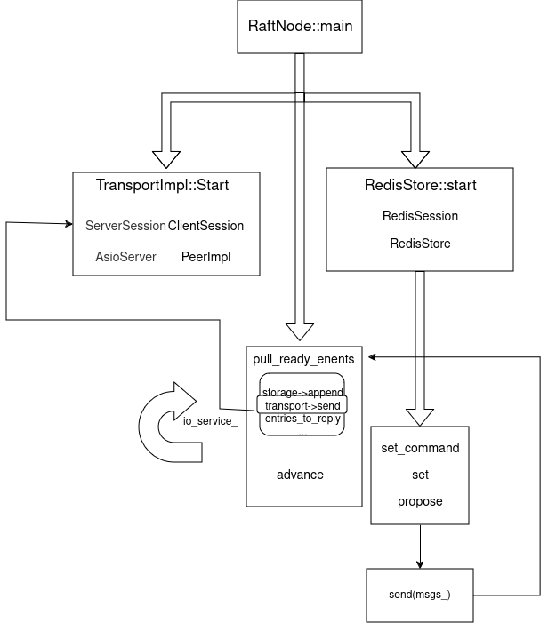

# 1. 框架

## 1.1. 线程 

首先理清各个线程的工作

main 函数中

```cpp
    GOptionEntry entries[] = {
        {"id", 'i', 0, G_OPTION_ARG_INT64, &g_id, "node id", NULL},
        {"cluster", 'c', 0, G_OPTION_ARG_STRING, &g_cluster, "comma separated cluster peers", NULL},
        {"port", 'p', 0, G_OPTION_ARG_INT, &g_port, "key-value server port", NULL},
        {NULL}};
```

示例：

```cpp
node1: ./raft-kv/build/raft-kv --id 1 --cluster=127.0.0.1:12379,127.0.0.1:22379,127.0.0.1:32379 --port 63791
node2: ./raft-kv/build/raft-kv --id 2 --cluster=127.0.0.1:12379,127.0.0.1:22379,127.0.0.1:32379 --port 63792
node3: ./raft-kv/build/raft-kv --id 3 --cluster=127.0.0.1:12379,127.0.0.1:22379,127.0.0.1:32379 --port 63793
```

如 node1:g_id=1，g_cluster=127.0.0.1:12379,127.0.0.1:22379,127.0.0.1:32379,g_port=63791

在 RaftNode::main 函数中，首先构造函数实例化了 g_node，在构造函数中统计了 peer 的数量，同时在 main 函数中启动了 transport 传输层，详细见 2.3，并创建了一个新的线程,并在该线程中运行 io_service_ 的事件循环，因为io_service_.run()是阻塞的，为了不阻塞主线程，将其放在一个独立的线程中运行。意味着与 boost::asio 相关的所有事件处理逻辑都会在这个新线程中运行

```cpp
    void start(const std::string &host) final {
        //创建IoServer实例
        server_ = IoServer::create((void *)&io_service_, host, raft_);
        //启动IoServer，开始监听主机host的端口，等待客户端的连接请求
        server_->start();
        //创建一个新线程，该线程运行io_service的run()函数
        //io_service_.run()用于执行异步操作的事件循环，处理来自客户端的连接、数据读取等异步操作
        io_thread_ = std::thread([this]() { this->io_service_.run(); });
    }
```

server_->start 代码如下：

```cpp
    void start() final {
        //创建一个新的ServerSession对象的共享指针
        ServerSessionPtr session(new ServerSession(io_service_, this));
        //异步接受传入连接并将连接关联到session->socket
        acceptor_.async_accept(session->socket,
                               [this, session](const boost::system::error_code &error) {
                                   if (error) {
                                       LOG_DEBUG("accept error %s", error.message().c_str());
                                       return;
                                   }
                                   //递归调用start，以便接受下一个连接，确保服务器始终在接受新的连接
                                   this->start();
                                   //启动读取元数据的异步操作
                                   session->start_read_meta();
                               });
    }
```

acceptor_.async_accept 注册了一个异步接受连接的操作，这个操作会被 boost::asio::io_service 的事件循环所调度，而事件循环运行在独立的线程中，因此 是在这个线程中执行的。同理，add_peer 方法相关的 PeerImpl 和 ClientSession 也运行在这个新的线程中。


在RaftNode::schedule()中，启动 redis 服务时，又创建了一个新的线程

```cpp
//初始化并启动Redis服务
    redis_server_ = std::make_shared<RedisStore>(this, std::move(snap_data_), port_);
    std::promise<pthread_t> promise;
    std::future<pthread_t> future = promise.get_future();
    redis_server_->start(promise);
    future.wait();
    pthread_t id = future.get();
    LOG_DEBUG("server start [%lu]", id);
```


综上可以发现每个 node 共有三个线程在工作。



## 1.2. 应用层

启动程序后，RaftNode 类调用 RedisStore 启动 redis 服务器，RedisSession 用于进行程序的收发，调用 handle_read 处理接收到的数据，并对接收到的消息进行解析，调用 相应 的方法处理 RedisReply 对象，以 set 为例，set_command 调用  RedisStore 的 set 方法

```cpp
void RedisSession::set_command(std::shared_ptr<RedisSession> self, struct redisReply *reply) {
    assert(reply->type = REDIS_REPLY_ARRAY);
    assert(reply->elements > 0);
    char buffer[256];

    if (reply->elements != 3) {
        LOG_WARN("wrong elements %lu", reply->elements);
        int n = snprintf(buffer, sizeof(buffer), shared::wrong_number_arguments, "set");
        self->send_reply(buffer, n);
        return;
    }

    if (reply->element[1]->type != REDIS_REPLY_STRING
        || reply->element[2]->type != REDIS_REPLY_STRING) {
        LOG_WARN("wrong type %d", reply->element[1]->type);
        self->send_reply(shared::wrong_type, strlen(shared::wrong_type));
        return;
    }
    std::string key(reply->element[1]->str, reply->element[1]->len);
    std::string value(reply->element[2]->str, reply->element[2]->len);
    self->server_->set(std::move(key), std::move(value), [self](const Status &status) {
        if (status.is_ok()) {
            self->send_reply(shared::ok, strlen(shared::ok));
        } else {
            char buff[256];
            int n = snprintf(buff, sizeof(buff), shared::err, status.to_string().c_str());
            self->send_reply(buff, n);
        }
    });
}
```

调用 server_->set 方法时，传入了 key，value 和一个回调函数

```cpp
//设置一个键值对并通过raft协议进行提交，同时支持异步回调函数通知提交结果
void RedisStore::set(std::string key, std::string value, const StatusCallback &callback) {
    //生成一个唯一的提交id
    uint32_t commit_id = next_request_id_++;
    //构建raft提交对象
    RaftCommit commit;
    commit.node_id = static_cast<uint32_t>(server_->node_id());
    commit.commit_id = commit_id;
    commit.redis_data.type = RedisCommitData::kCommitSet;
    commit.redis_data.strs.push_back(std::move(key));
    commit.redis_data.strs.push_back(std::move(value));
    //序列化提交对象
    msgpack::sbuffer sbuf;
    msgpack::pack(sbuf, commit);
    std::shared_ptr<std::vector<uint8_t>> data(
        new std::vector<uint8_t>(sbuf.data(), sbuf.data() + sbuf.size()));
    //将回调函数保存到pending_requests_映射中，使用提交ID作为键
    pending_requests_[commit_id] = callback;
    //提交数据到raft节点
    server_->propose(std::move(data), [this, commit_id](const Status &status) {
        //处理提交结果，使用io_service_.post将结果处理函数添加到IO服务的事件队列中
        io_service_.post([this, status, commit_id]() {
            if (status.is_ok()) {
                return;
            }
            //在结果处理函数中，如果提交失败，调用保存的回调函数，并从pending_request_中移除对应条目
            auto it = pending_requests_.find(commit_id);
            if (it != pending_requests_.end()) {
                it->second(status);
                pending_requests_.erase(it);
            }
        });
    });
}
```

set 方法调用 RaftNode 的 propose 方法，然后用等待队列阻塞等待消息处理完成

RaftNode 的 propose 方法

```cpp
void RaftNode::propose(std::shared_ptr<std::vector<uint8_t>> data, const StatusCallback &callback) {
    //当前线程与存储的线程ID不匹配，使用io_service_.post将任务提交到IO服务线程中执行
    if (pthread_id_ != pthread_self()) {
        io_service_.post([this, data, callback]() {
            Status status = node_->propose(std::move(*data));
            callback(status);
            pull_ready_events();
        });
    } else {
        Status status = node_->propose(std::move(*data));
        callback(status);
        pull_ready_events();
    }
}
```

**其中的三个回调函数：**

RaftNode::propose 的回调函数：调用 node_->propose 结束后，调用传入给 RaftNode::propose 的方法的回调函数

RedisStore::set 的回调函数：在结果处理函数中，如果提交失败，调用保存的回调函数，并从pending_request_中移除对应条目

RedisSession::set_command 的回调函数：由第二条调用


RedisStore::set 方法调用RaftNode::propose

RaftNode::propose 注册一个等待队列，调用 node_->propose,然后用等待队列阻塞等待消息处理完成。propose 方法会推送一条 MsgProp 消息，对于节点间的消息调用 raft 的 step 消息。可以看到外界所有消息此时都到了 node 结构中.


raft对象封装了raft的协议数据和操作，其对外的Step方法是真正raft协议状态机的步进方法。当接收到消息以后，根据协议类型、Term字段做相应的状态改变处理，或者对选举请求做相应处理。对于一般的kv增删改查数据请求消息，会调用内部的step方法。内部的step方法是一个可动态改变的方法，将随状态机的状态变化而变化。当状态机处于leader状态时，该方法就是stepLeader；当状态机处于follower状态时，该方法就是stepFollower；当状态机处于Candidate状态时，该方法就是stepCandidate。leader状态会直接处理MsgProp消息。将消息中的日志条目存入本地缓存。follower则会直接将MsgProp消息转发给leader，转发的过程是将先将消息推送到raft的msgs数组中。 node处理完消息以后，要么生成了缓存中的日志条目，要么生成了将要发送出去的消息。缓存中的日志条目需要进一步处理(比如同步和持久化)，而消息需要进一步处理发送出去。处理过程还是在node的这个线程中，在循环开始会调用newReady，将需要进一步处理的日志和需要发送出去的消息，以及状态改变信息，都封装在一个Ready消息中。

raftNode 中 io_service 循环调用 ，会调用 pull_ready_events 方法，当有新的 ready 对象时，则会调用 transport 的 send 方法，进行节点间的通信，将日志复制，心跳消息等，传输给 peer 节点

## 1.3. 节点间消息传递

每个 RaftServer 中包含有 Transport 结构，Transport中会有一个peers的map，每个peer封装了节点到其他某个节点的通信方式

【AsioServer+ServerSession】 实现节点接受数据的功能，`【PeerImpl+ClientSession】`实现了节点发送数据的功能。


在 RaftNode::main 函数中：

TransportImpl 会将 tcp 服务端 AsioServer 启动，并在 AsioServer 的 start 方法中实例化ServerSession，开始读取数据。

在获取 peers 列表后通过 TransportImpl 的 add_peer 方法，添加新的 peer，并实例化启动 PeerImpl，开始发送数据


# 2.参考

https://www.zhaowenyu.com/etcd-doc/principle/etcd-arch.html